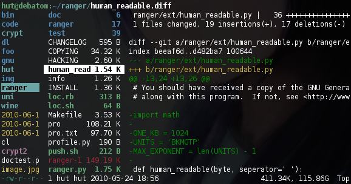
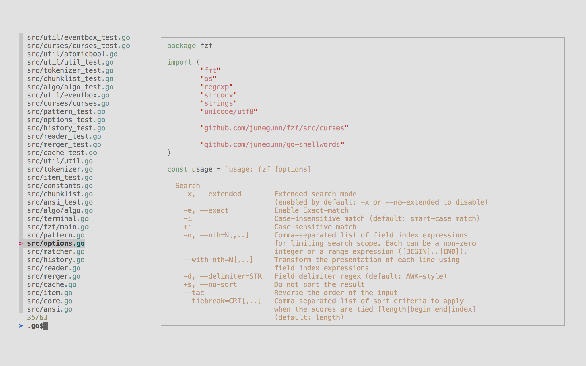

终端是程序员的必备工具之一，10 倍程序员的终端跟普通程序员有何不同？本文将介绍许多牛逼且实用的开源工具，用上这些工具后你不一定会变成 10 倍程序员，但绝对能够让你感觉自己像个 10 倍程序员。

本文仅对工具做基本介绍，不提供安装方法，因为这些工具的安装方法在项目的 github 首页上基本都会提供，在掘金上也能找到许多具体的使用教程。

在终端准备部分介绍的工具是跟操作系统相关的，终端内的命令行工具则基本上是 ``跨平台`` 的，可以在 mac、linux、windows 上使用。

本文介绍的工具在下表中可以查阅，数据按照发文时的 star 数量倒序排列，方便读者朋友挑选。

| 工具 | 地址 | stars |
| --- | --- | --- |
| oh my zsh | https://github.com/ohmyzsh/ohmyzsh |  |
| terminal | https://github.com/microsoft/terminal |  |
| the fuck | https://github.com/nvbn/thefuck |  |
| fzf | https://github.com/junegunn/fzf |  |
| tldr | https://github.com/tldr-pages/tldr |  |
| bat | https://github.com/sharkdp/bat |  |
| vimrc | https://github.com/amix/vimrc |  |
| vim | https://github.com/vim/vim |  |
| fd | https://github.com/sharkdp/fd |  |
| exa | https://github.com/ogham/exa |  |
| z | https://github.com/rupa/z |  |
| powerline | https://github.com/powerline/powerline |  |
| zsh-syntax-highlighting | https://github.com/zsh-users/zsh-syntax-highlighting |  |
| nnn | https://github.com/jarun/nnn |  |
| iTerm2 | https://github.com/gnachman/iTerm2 |  |
| ranger | https://github.com/ranger/ranger |  |

## 终端准备

### Windows Terminal

地址：https://github.com/microsoft/terminal

看这 star 数量，便知无需过多介绍，微软多年后终于意识到自家的终端实在是太简陋了，用上 Windows Terminal 后可以抛弃掉 cmder、cygwin 了。

要让其发挥终端的强大威力，还需要安装 ``WSL2``，推荐安装 ubuntu。

可以为不同的 shell 环境设置不同的背景、主题，其还支持与 VS Code 一样的 ``CTRL+SHIFT+P`` 快捷键打开快速命令窗口，方便操作。

### iTerm2

地址：https://github.com/gnachman/iTerm2

作为 mac 上首选用来替换默认终端的 iTerm2 自然也无需过多介绍，它拥有超多的特性，比如：分割面板、快捷键增强、优化的搜索、自动完成、粘贴历史、高度可配置等等，它拥有超多的主题，主题的 star 数量甚至超过本体的 star 数量。

功能介绍：https://iterm2.com/features.html 。

丰富主题：https://github.com/mbadolato/iTerm2-Color-Schemes 。

## shell 环境

### oh my zsh

地址：https://github.com/ohmyzsh/ohmyzsh

超过 12 万的 star 数，可见 oh my zsh 多么受欢迎，该项目主要用于简化 zsh 的配置，自带并支持超多有用的插件。

> Oh My Zsh will not make you a 10x developer...but you may feel like one!

本文的标题实际上借鉴了 oh my zsh 官网的这段话，用上它后你的 shell 环境将焕然一新，还有以下的插件是你务必要装上试一试的。

1. zsh-syntax-highlighting
  
    

    地址：https://github.com/zsh-users/zsh-syntax-highlighting

    一句话点评：语法高亮为终端增添色彩。

2. zsh-autosuggestions

    

    地址：https://github.com/zsh-users/zsh-autosuggestions

    一句话点评：程序员怎能离开智能提示？

3. z

    

    地址：https://github.com/rupa/z

    一句话点评：切换目录比资源管理器用起来还方便。

### powerline

地址：https://github.com/powerline/powerline

终端本身是高效的，但有时也略显乏味，使用 powerline 可以为终端加上强大的 ``状态栏``，比如在 vim 中显示当前状态，在打开 git 目录时显示当前分支等等。

## 系统工具

### 文件管理器

很多人用不惯终端的一个原因就是在上面无法像 windows资源管理器或 finder 一样操作文件，实际上有许多开源的命令行文件管理器，下面介绍两个热门的，大家按需选用。

1. ranger

    

    地址：https://github.com/ranger/ranger

    Ranger 使用 Python 编写，默认为使用 ``vim`` 风格的按键绑定，对于使用 vim 的用户来说几乎没有学习成本，能够快速上手使用。

    

2. nnn

    

    地址：https://github.com/jarun/nnn

    nnn (n³) 是一个功能齐全的终端文件管理器，速度非常快且几乎 0 配置，也是一个非常不错的选择。

### vim

地址：https://github.com/vim/vim

终端下还有比 vim 更好用的文本编辑器吗？ vi 不仅仅是一个文本编辑器，它无处不在，如果说 10 倍程序员有什么标配，那 vim 大概率会是其中之一。

要调教好 vim 也需要一番配置，有不少人在 Github 上分享自己的配置文件，但要说最好用且适合大多数人的还是下面这个项目。

- vimrc
    
   

    地址：https://github.com/amix/vimrc

## 命令增强

终端下有许多原生的命令可以满足基本使用，但有些命令并不足够好用，下面介绍几个替代工具。

1. exa

    

    地址：https://github.com/ogham/exa

    一句话点评：用来替换 ``ls`` 命令的现代化工具。

2. fd

    

    地址：https://github.com/sharkdp/fd

    一句话点评：简单、快速、好用，用于替换 ``find`` 的搜索工具。
3. bat

    

    地址：https://github.com/sharkdp/bat

    一句话点评：``cat`` 的替代品，是猛男就用 bat。

## 其他让人赞叹的工具

### fzf

地址：https://github.com/junegunn/fzf

fzf 是一款支持模糊搜索的交互式工具，可以用来查找任何列表内容，包括文件、Git 分支、进程等。

### tldr

地址：https://github.com/tldr-pages/tldr

tdlr 是 ``Too long, Don't read`` 的缩写，可以帮助你快速查看常用命令的使用实例，比如 tar 命令，那后面一长串参数谁记得清呢？当然，linux 大佬除外。

### The Fuck

地址：https://github.com/nvbn/thefuck

在终端下是不是经常输错命令，搞得自己心烦意乱，``The Fuck`` 是一款了不起的工具，帮你彻底解决这个问题，当你输错命令后，只要输入 ``fuck`` 命令，它会帮你自动纠正错误，精彩之极！

### w3m

地址：https://github.com/tats/w3m

真正的程序员就该使用命令行来浏览网页。

## 10 倍程序员之路

w3m 这个项目已经基本不维护了，我以这个命令来结束本篇文章，因为还有许多像这样优秀好玩的工具等待我们去发现、去创造。

程序员的双手是魔术师的双手，他们将代码转变成丰富多彩的软件，即使是平平无奇的终端竟然也能玩出许多花样。

普通程序员使用工具，10 倍程序员使用优秀的工具再造工具，10 倍程序员不是概念，而是真实存在的，今天的我看上去像，明天的我真的可以做到，加油吧，程序员们。
