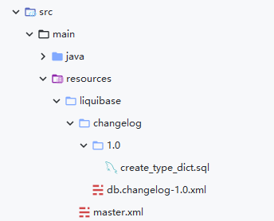

Java 生态下的数据库版本控制工具有 Flyaway 和 Liquibase，两者具备相似的功能，但基本概念不太一样，本文不对两者进行比较，主要介绍使用 Liquibase 进行数据库版本控制。

本文涉及的工具有 maven、mysql。

## 添加依赖

在 pom 文件中引入必要的依赖：

```xml
<dependencies>
  <dependency>
    <groupId>org.springframework.boot</groupId>
    <artifactId>spring-boot-starter-jdbc</artifactId>
  </dependency>
  <dependency>
    <groupId>org.liquibase</groupId>
    <artifactId>liquibase-core</artifactId>
  </dependency>
  <dependency>
    <groupId>mysql</groupId>
    <artifactId>mysql-connector-java</artifactId>
  </dependency>
</dependencies>
```

由于 spring-boot-starter-jdbc 中含有 spring-boot-starter、spring-boot-autoconfigure 依赖，我们只需要引入这一个依赖即可。

spring boot 框架整合了许多第三方库，这其中包括 Liquibase，在 autoconfigure 模块中包含 Liquibase 的可选依赖和 LiquibaseAutoConfiguration 类，下面是这个类上的部分注解代码。

```java
@ConditionalOnClass({SpringLiquibase.class, DatabaseChange.class})
@ConditionalOnProperty(
    prefix = "spring.liquibase",
    name = {"enabled"},
    matchIfMissing = true
)
@AutoConfigureAfter({DataSourceAutoConfiguration.class, HibernateJpaAutoConfiguration.class})
public class LiquibaseAutoConfiguration {
}
```

可以看到该自动配置在 DataSourceAutoConfiguration 配置之后执行，因此必须引用 spring-boot-starter-jdbc 依赖，这是较容易被忽略的一点。


## 修改 Spring 配置

引入以上依赖后 Liquibase 默认就启用了，我们可以在 Spring 配置文件中添加相关的配置，数据库的相关配置请读者朋友根据机器运行环境进行修改。

```properties
spring.datasource.url = jdbc:mysql://localhost/db?createDatabaseIfNotExist=true&allowMultiQueries=true&useUnicode=true&characterEncoding=utf8&serverTimezone=GMT%2B8
spring.datasource.username = root
spring.datasource.password = root
spring.datasource.driver-class-name = com.mysql.cj.jdbc.Driver

spring.liquibase.change-log = classpath:liquibase/master.xml
spring.liquibase.contexts = dev
```

注意：datasource 的 url 中包含 **createDatabaseIfNotExist=true** 配置，这将使数据库在不存在时自动创建。

在配置中只简单指定了 change-log 和 contexts 两个属性，更多的属性可查看 **LiquibaseProperties** 类，其中包含部分属性的默认值，若使用默认值，以上两个属性都不需要配置，默认的 changeLog 地址为：classpath:/db/changelog/db.changelog-master.yaml 。

## 编写 Liquibase 配置代码

首先看下文件的组织：



这是官方推荐的方式，使用发布版本号来组织数据库变更记录。

---

master.xml 中的代码：

```xml
<?xml version="1.0" encoding="utf-8"?>
<databaseChangeLog
        xmlns="http://www.liquibase.org/xml/ns/dbchangelog"
        xmlns:xsi="http://www.w3.org/2001/XMLSchema-instance"
        xsi:schemaLocation="http://www.liquibase.org/xml/ns/dbchangelog
         http://www.liquibase.org/xml/ns/dbchangelog/dbchangelog-3.1.xsd">

    <include file="liquibase/changelog/db.changelog-1.0.xml"/>

</databaseChangeLog>
```

有更新时新增 include 标签和对应的文件即可。

---

db.changelog-1.0.xml 中的代码：

```xml
<?xml version="1.0" encoding="UTF-8"?>
<databaseChangeLog
        xmlns="http://www.liquibase.org/xml/ns/dbchangelog"
        xmlns:xsi="http://www.w3.org/2001/XMLSchema-instance"
        xsi:schemaLocation="http://www.liquibase.org/xml/ns/dbchangelog
         http://www.liquibase.org/xml/ns/dbchangelog/dbchangelog-3.1.xsd">

    <changeSet id="create_type_dict" author="lcomplete">
        <sqlFile path="liquibase/changelog/1.0/create_type_dict.sql"/>
    </changeSet>

</databaseChangeLog>
```

一个变更对应一个 changeSet，在这里意味着一个变更对应一个 sql，若在一个 sql 中编写多个变更，不利于回滚，可能导致数据库进入未预期的状态。

changeSet 中包含 author 和 id 两个必写的属性，这两个属性组成了变更的唯一标志，注意 id 并不是用来控制执行顺序的。

changeSet 还包含一些属性，比如 Contexts ，可以控制 changeSet 是否需要在当前环境（上文演示了在 Spring 配置中如何设置）中执行，使用这个属性可以在测试环境增加一些需要额外执行的变更，比如填充数据。 更多属性可以查看：https://docs.liquibase.com/concepts/basic/changeset.html。

---

create_type_dict.sql 中的代码：

```sql
create table type_dict
(
    id          int auto_increment primary key,
    category    varchar(255) not null comment '分类',
    type_key    int          not null comment '类型key',
    type_value  varchar(255) null comment '类型值',
    is_enable   bit null comment '是否启用',
    create_time datetime null comment '创建时间'
) collate = utf8mb4_general_ci;
```

这个 sql 中包含一个示例建表语句，注意：不需要判断表是否存在，若这次变更执行过，Liquibase 会在自动创建的表 databasechangelog（默认表名、可配置） 中记录下来，下次不再执行。

---

在上面的配置中，使用 sql 来创建数据表，Liquibase 还支持使用 xml、json、yaml 来定义表，在大多数场景下使用 sql 就足够了，因此这里不介绍其他的用法。

## 完结撒花

编写完成以上的配置代码，添加 Spring Boot 应用程序启动类运行程序即可自动更新数据库。

是不是很简单？当然在实际的项目过程中，还需要考虑 Liquibase 配置在流水线中如何运行，Liquibase 的代码仓库如何组织等问题，这些就留给读者朋友自己思考吧（其实是笔者比较懒，先不写了）。

关于 Liquibase 的更多概念可以查看官方文档：<https://docs.liquibase.com/concepts/home.html> 。